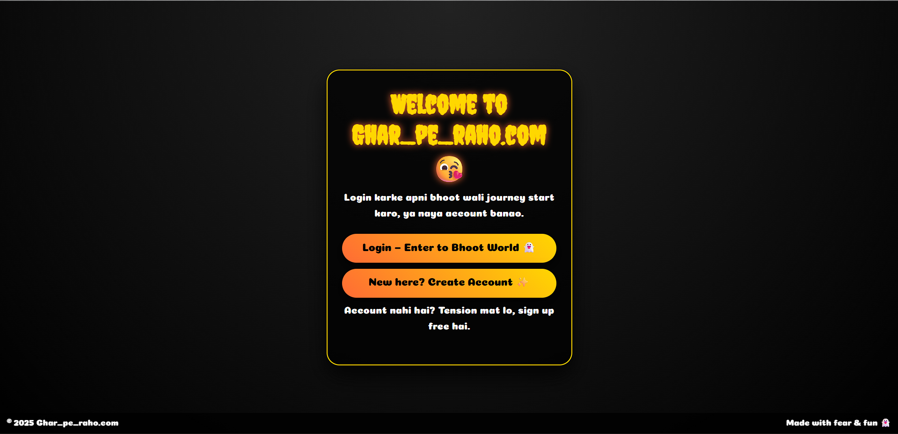
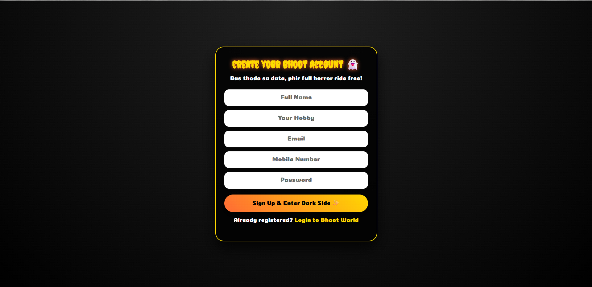
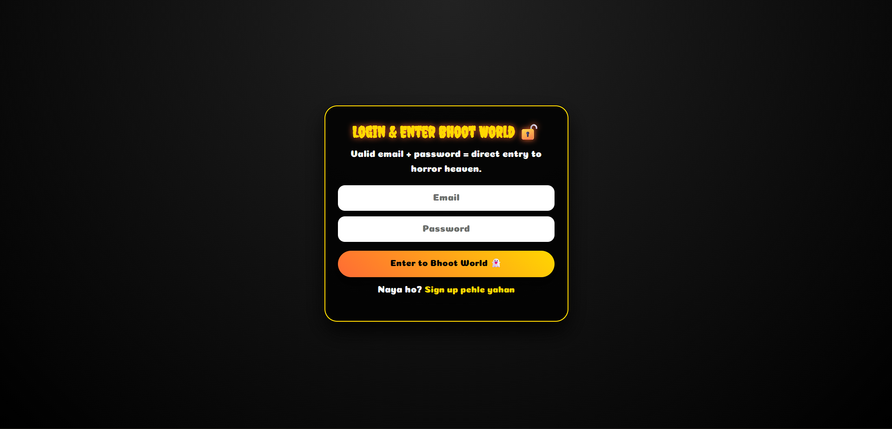
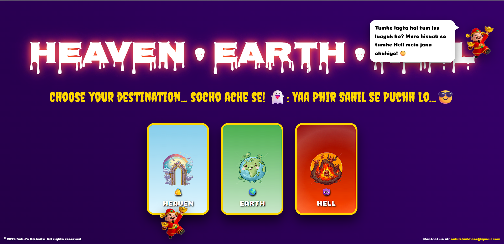
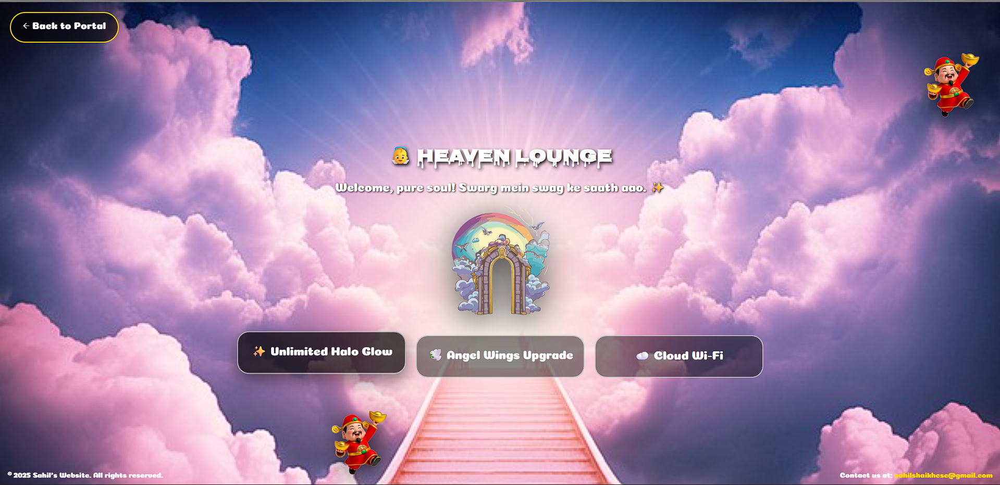
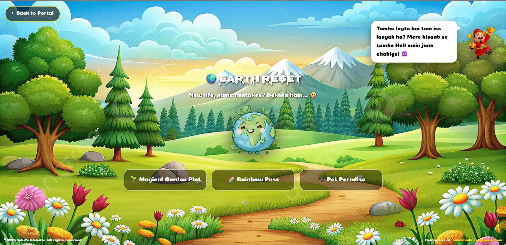
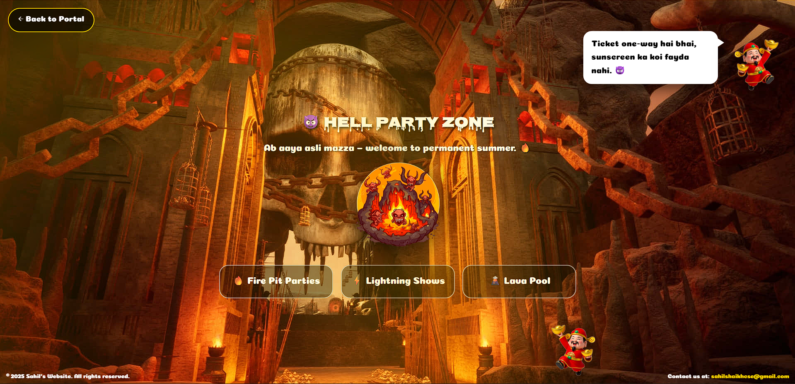

# 👻 Ghar_pe_raho.com – Ghost Portal

Welcome to **Ghar_pe_raho.com**, a fun horror‑cartoon style web app where users can log in and choose a portal to **Heaven, Earth, or Hell**.  
This project combines HTML, CSS, JavaScript, PHP, and MySQL – great for a DevOps or web development portfolio.

---

## ✨ Features

- Animated **Heaven • Earth • Hell** portal with background music  
- Funny **God guide** with random dialogues  
- Hover sound effects and horror theme  
- **Login / Sign Up system** (PHP + MySQL)  
- User data stored in a **`users`** table (name, hobby, email, phone, password hash)  
- Ghost world protected – only logged‑in users can access

---

## 🧩 Tech Stack

- **Frontend:** HTML5, CSS3, JavaScript  
- **Backend:** PHP (procedural)  
- **Database:** MySQL (phpMyAdmin via XAMPP)  
- **Local server:** XAMPP (Apache + MySQL)

---

## 📁 Folder Structure

```text
Hell/
├── index.html          # Main ghost portal (Heaven/Earth/Hell)
├── welcome.html        # Welcome + life goal intro page
├── login.php           # Login form (frontend)
├── signup.php          # Signup form (frontend)
├── assets/             # Images, audio, CSS
│   ├── css/
│   ├── img/
│   └── audio/
└── Backend/
    ├── config.php      # Database connection
    ├── signup.php      # Signup logic (INSERT user)
    ├── login.php       # Login logic (SELECT + verify)
    └── logout.php      # (optional) Destroy session
```

---

## 🛠️ How to run locally

### 1. Install & start XAMPP

1. Install XAMPP (Apache + MySQL).  
2. Open the XAMPP Control Panel and start:
   - **Apache**  
   - **MySQL**

### 2. Copy the project into `htdocs`

1. Clone or download this repo.  
2. Place the project folder here:  
   `C:\xampp\htdocs\Hell\`  
3. Final path example:  
   `C:\xampp\htdocs\Hell\index.html`

---

## 🗄️ Database setup (phpMyAdmin)

1. Open phpMyAdmin in your browser: `http://localhost/phpmyadmin`  
2. Create a new database:

   ```sql
   CREATE DATABASE ghar_portal;
   ```

3. Select the `ghar_portal` database → go to the **SQL** tab → create the `users` table:

   ```sql
   CREATE TABLE users (
     id INT AUTO_INCREMENT PRIMARY KEY,
     name VARCHAR(100) NOT NULL,
     hobby VARCHAR(100) NOT NULL,
     email VARCHAR(150) NOT NULL UNIQUE,
     phone VARCHAR(20) NOT NULL,
     password_hash VARCHAR(255) NOT NULL,
     created_at TIMESTAMP DEFAULT CURRENT_TIMESTAMP
   );
   ```

---

## 🔐 Backend configuration

In `Backend/config.php`, set your local MySQL credentials:

```php
<?php
$DB_HOST = "localhost";
$DB_USER = "root";        // default XAMPP user
$DB_PASS = "";            // leave empty if you did not set a password
$DB_NAME = "ghar_portal";

$conn = new mysqli($DB_HOST, $DB_USER, $DB_PASS, $DB_NAME);

if ($conn->connect_error) {
    die("Database connection failed: " . $conn->connect_error);
}

$conn->set_charset("utf8mb4");
?>
```

> If you use a password to log into phpMyAdmin, put the same password in `$DB_PASS`.

---

## 👥 Auth flow (Sign Up / Login)

1. User first opens the **welcome page**:  
   `http://localhost/Hell/welcome.html`

  
   
3. From there:
   - **Sign Up** → `signup.php` form → posts to `Backend/signup.php` which saves the user in the DB.
     
  
   - **Login** → `login.php` form → posts to `Backend/login.php` which verifies email + password.
     

4. On successful login, the user is redirected to **`index.html` (ghost portal)**.

Passwords are stored securely using `password_hash()` and checked with `password_verify()`.

---

## 🎮 How to use the portal

1. Go to: `http://localhost/Hell/welcome.html`  
2. Enter your life goal → Sign Up or Login  


3. After login:
   - Home = Three options you have
     

   - Heaven = chill + sparkles
     
 
   - Earth = normal life reset
     

   - Hell = full horror party mode 🔥
     


4. Hover over services, click on doors, and enjoy the god’s dialogues.


---

## 📚 Future improvements

- User profile page (show name, hobby, last visited realm)  
- Logout button + session timeout  
- Admin panel to view all registered users  
- Deployment to a free PHP hosting provider (InfinityFree, 000WebHost, etc.)

---

## 👤 Author

- **Name:** Sahil Shaikh 
- **GitHub:** sahilshaikh867  

Feel free to fork, customize, or use this project for college demos and DevOps presentations. With Permissions
```
